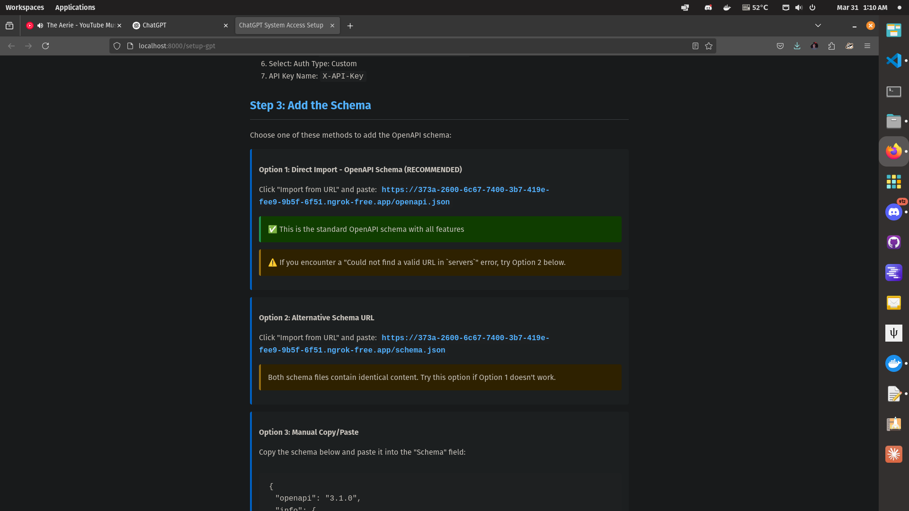
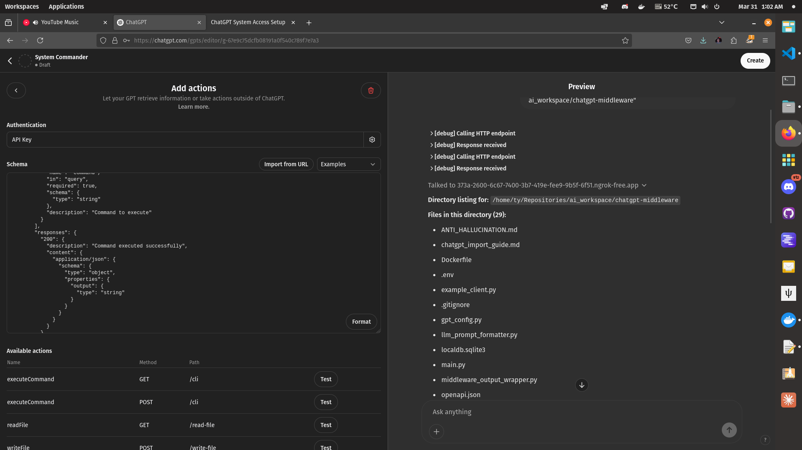

# ChatGPT-Middleware System Commander

CLI, File System, SQLite Access for OpenAI Custom GPTs- Simple To Use, maybe has issues, AI generated, I am not a coder, use at own risk!!!

A streamlined platform agnostic middleware solution that gives ChatGPT Custom GPTs access to your system through three basic tools:

1. **Command Line Interface (CLI)** - Run system commands
2. **Filesystem Access** - Read and write files
3. **SQLite Database** - Store and retrieve data


Requires NGROK free dev account, select your platform and install:

https://dashboard.ngrok.com/get-started/setup/linux

Then:

## ⚡ One-Click Setup & Run

```bash
# Clone the repository 
git clone https://github.com/angrysky56/chatgpt-middleware.git
cd chatgpt-middleware

# Run the all-in-one script (setup, ngrok, and server)
python run.py
```

- You will be prompted to add or remove allowed directories

- Creates a page at http://localhost:8000/setup-gpt with clear instructions, local api key and url generation for your Custom GPT.

## Important: Select the url from option 2, option 1 is broken currently



That's it! The script handles everything:

- Creates a virtual environment
- Installs dependencies
- Generates a secure API key
- Starts the server
- Connects with ngrok (if available)
- Updates the OpenAPI schema

## 🔌 Setting Up Your Custom GPT

Once the server is running:

1. Visit the setup page: http://localhost:8000/setup-gpt
2. Follow the instructions to create your Custom GPT
3. Import the OpenAPI schema from your ngrok URL

> ⚠️ **Important**: ChatGPT requires a publicly accessible URL for custom GPT Actions to work. The ngrok URL is automatically detected and configured in your OpenAPI schema.

## 🛠️ What Your Custom GPT Can Do (Currently mostly untested)



Once connected, your Custom GPT can:

- **Run commands**: "List all files in the current directory"
- **Read files**: "Show me the content of config.json"
- **Write files**: "Create a file called notes.txt with this content..."
- **Store data**: "Save this information to the database"

## 🔒 Security

- The system runs with "medium" security by default
- Access is restricted to your current directory
- A unique API key is generated automatically
- Dangerous system commands are blocked

## 🔧 For Developers

## 📋 Manual Configuration

You can edit the `.env` file to change:

- Your API key
- Security level (high/medium/low)
- Allowed file paths

### Manual Path Configuration

By default, the middleware restricts file access to the current working directory for security.
To allow access to additional directories, add them to the `.env` file:

```env
# For Windows (use backslashes or escaped backslashes)
ALLOWED_PATHS=C:\Users\username\Documents,C:\Projects

# For macOS/Linux (use forward slashes)
ALLOWED_PATHS=/home/username/Documents,/var/www/html
```

Leave `ALLOWED_PATHS` empty to use only the current directory.

## 🛠️ Command Line Options

```bash
# Start without ngrok
python run.py --no-ngrok
```

If you prefer to run components separately:

```bash
# Start the server only
python -m uvicorn main:app --reload --port 8000

# Start ngrok in another terminal
ngrok http 8000

# Update the schema with the ngrok URL
python update_schema.py
```
